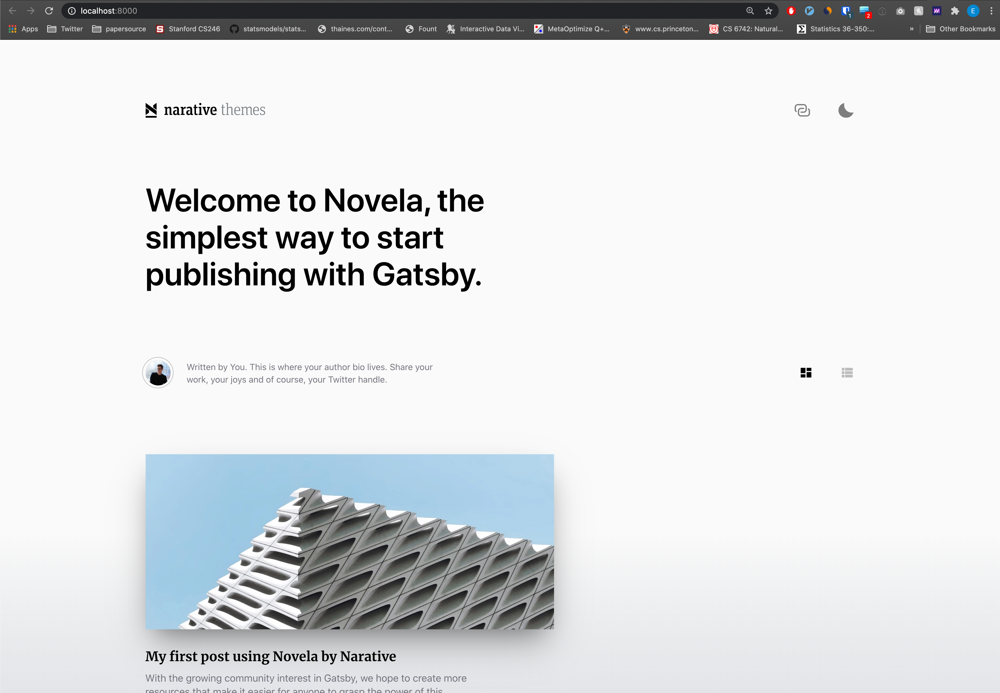

# Gatsby 中文设置教程

## 教程原文
教程原文博客在：[Gatsby 教程](https://kalasearch.cn/blog/gatsby-blog-setup-tutorial-with-netlify/)

## 生成博客
本文件夹中的 my-blog 即按下文步骤生成的代码，完整上下文请请阅读教程原文

## 配置

要开始构建一个 Gatsby 网站真的非常简单，请照以下步骤执行。本文的代码也放在 GitHub 上，欢迎参考，觉得有用的话也请帮忙加星: 

### 1. 确认本地安装了 npm

首先确保你的本地环境安装了 `npm`

如果你在 Mac/Linux 环境下运行的话请运行

`npm -v` 

如果你本地已经安装了 `npm` 那么本命令会输出 npm 的版本。

```
➜  gatsby git:(exie/add-gatsby) ✗ npm -v
6.14.4
```

如果没有打印出来版本，也就是还没有安装 `npm` 的话，请参考 [install npm](https://www.npmjs.com/get-npm)


### 2. 安装 Gatsby 命令行工具
请运行

`npm install -g gatsby-cli`

```
➜  gatsby git:(exie/add-gatsby) ✗ npm install -g gatsby-cli
...以下省略
```

这条命令会在全局安装 `gatsby` 的命令行工具。安装完后重启终端，应该就可以找到 `gatsby` 这个命令行了。

请运行 `gatsby -v` 确认已经安装好，应该输出类似

```
➜  gatsby git:(exie/add-gatsby) ✗ gatsby -v
Gatsby CLI version: 2.11.3
```

### 3. 用 Gatsby 命令行创建你的 Gatsby 网站

请到一个你准备放置你的博客的目录，然后用以下命令开始生成你的第一个 Gatsby 博客

`gatsby new my-blog https://github.com/narative/gatsby-starter-novela`

注意，这里的第三个参数，也就是这个网址的含义是模板地址。Gatsby 本身不提供太多的样式选择，但有很多开发者们会主动地贡献自己的模板，比如说这里的 `https://github.com/narative/gatsby-starter-novela` 就是我很喜欢的一个样式。

其它公开的模板可以在 `https://www.gatsbyjs.com/starters/` 找到。如果你有满意的模板，也可以贡献到这里。

### 4. 运行你的网站
进入刚创建的 `my-blog` 文件夹

然后运行 `gatsby develop`

这个命令会跑起来一个本地的 server，主要作用是让你可以在本地实时更新和开发你的网站。运行之后，它会默认在本地的 `8000` 端口跑起来一个 service，然后在浏览器访问 `http://localhost:8000/` 的话就可以看到你的网站了



至此，你就可以在 `content/posts/` 中开始添加你的博客文章。

注意，这里的路径都是可以配置的，慢慢熟悉 Gatsby 之后，你可以实现任何用其它框架可以实现的功能。


注：Gatsby 本身的教程绝对已经是非常上乘的了，如果读英文顺畅的话推荐直接阅读：[Get Started](https://www.gatsbyjs.com/docs/quick-start/)


